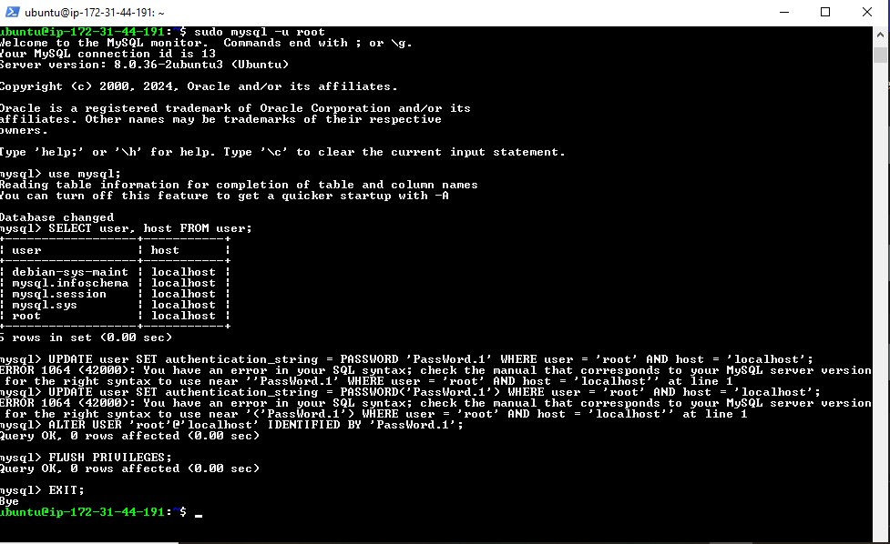
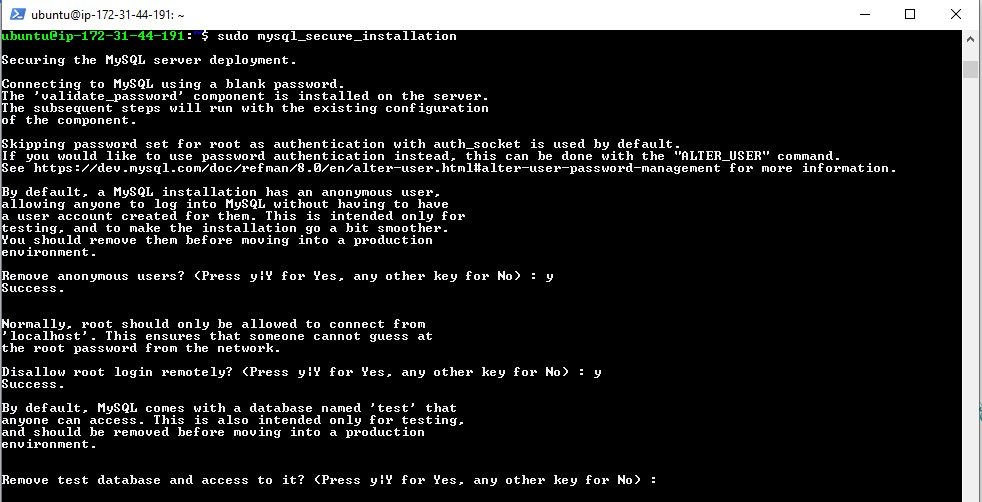

# Step 2 - Installimg MySQL

MySQL is a powerful and reliable solution for storing and managing data in web applications. Its open-source nature, scalability, and ease of use make it a popular choice for developers. If your project requires structured data storage and retrieval, MySQL is an excellent option to consider.

We install it by running the command

      $ sudo apt install mysql-server


Then we set password and exit



Then we start the interructive script by running

```powershell
$ sudo mysql_secure_installation
```



To ensure our database is working, we type $ sudo mysql -p in the terminal.

