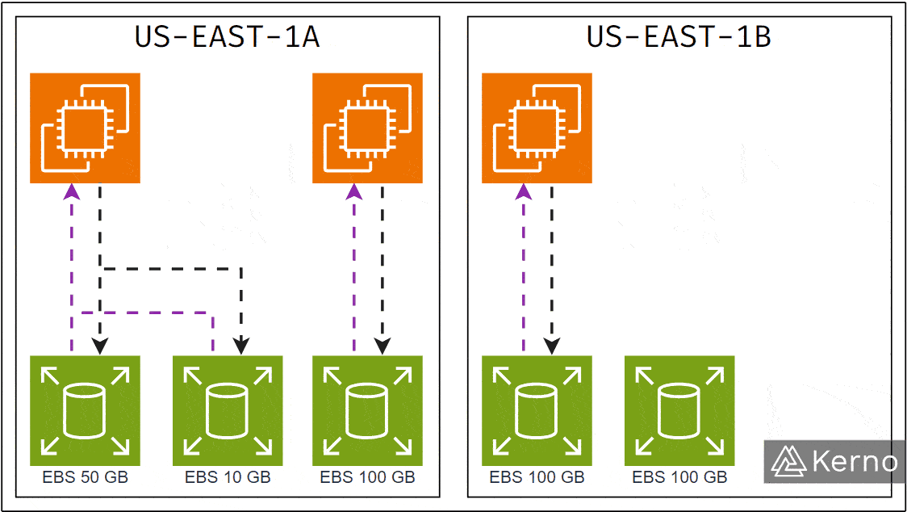
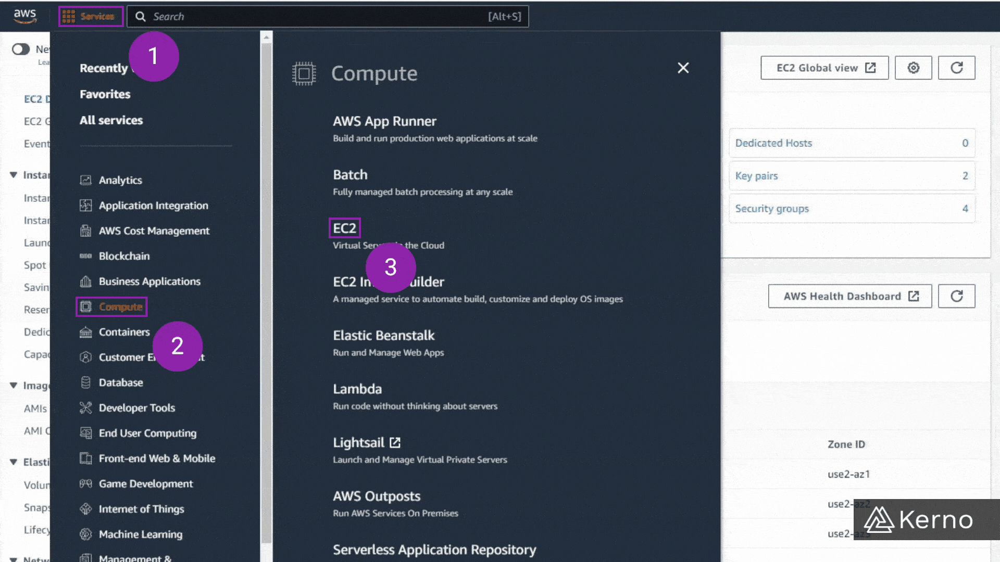
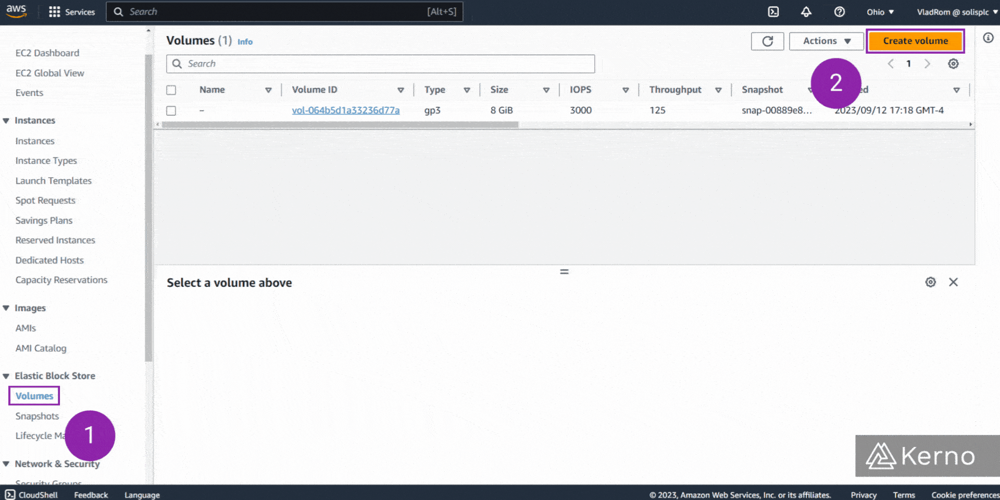
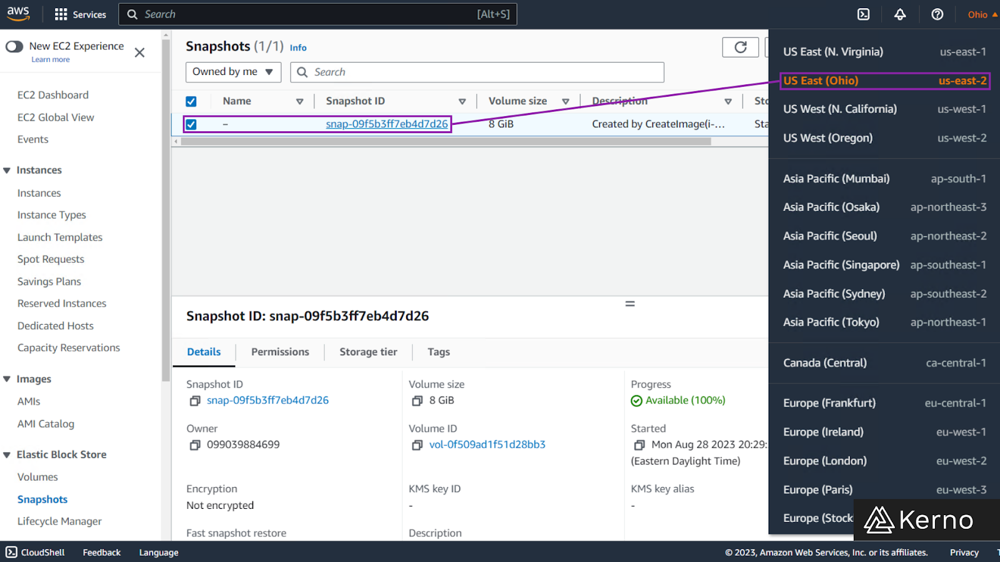
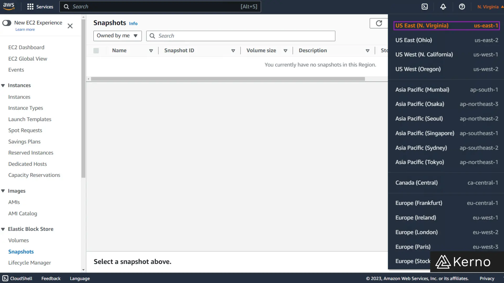
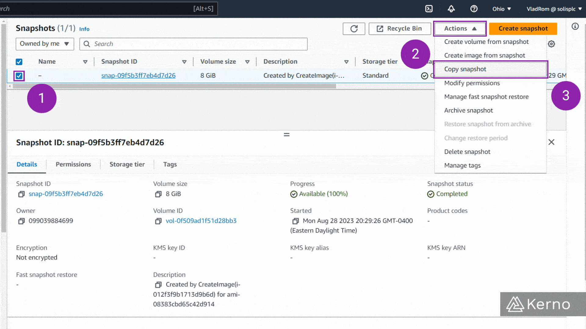
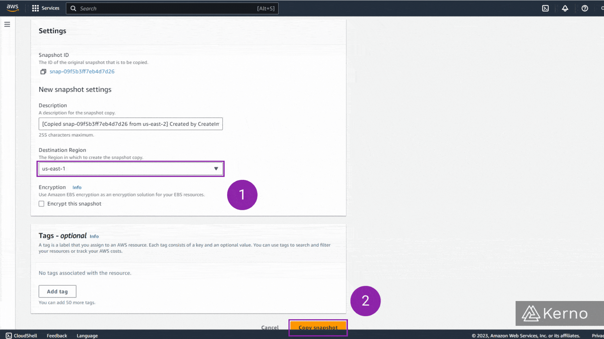
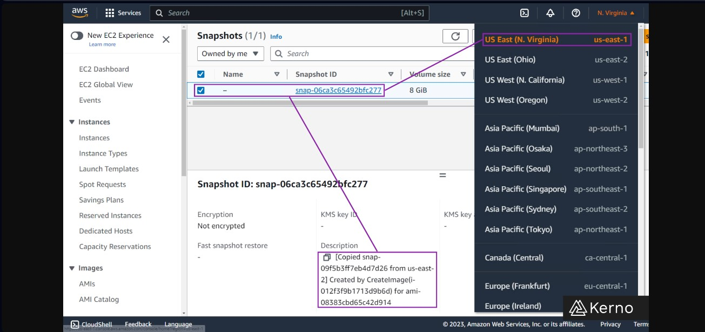

# AWS EBS: The Complete Guide

## What is EBS?

EBS, or Elastic Block Storage, is a network drive that can be attached to an EC2 Instance. By storing data on EBS, it’s possible to keep data that would otherwise be lost if the instance it was stored on was terminated. There are exceptions to the rule, but generally, EBS volumes are only attached to one instance. EBS volumes are provisioned with capacity and throughput.

###### _Figure 1.1 - EBS - Elastic Block Storage | A Diagram of how EBS is typically tied to EC2 instances_

**Notice a few items in the figure above:**

- More than one volume can be attached to a single instance.

- A volume can exist without being attached to any instance.

- EBS volumes are availability zone specific. It’s possible to migrate the data between AZs via snapshots, but a volume can’t be attached to an instance in a different AZ.

## EBS Key Takeaways

- EBS Volumes can be created on their own, be attached to an EC2 instance, or multiple EC2 instances via EBS Multi-Attach.

- BS Volumes come in 6 variations - gp2, gp3, io1, io2, st1, and sc1. Each type has been optimized for specific use cases and is prices accordingly.

- Users can specify the amount of storage, the throughput, and a few other parameters of an EBS Volume. It’s important to keep in mind that certain families will have constraints for those parameters.

- EBS Volumes are created in a specific Availability Zone. However, AWS provides tools that allow the user to create a backup and restore a different volume in a separate Availability Zone.

## EBS - Delete on Termination

When you specify and deploy a new EC2 Instance, you’ll have to configure the volume that will be attached to it. One of the options is “Delete on Termination.”

This option, as the name suggests, will result in the deletion of the volume as soon as the EC2 instance is terminated. Should you choose not to select this option, the volume will continue to exist in AWS after the EC2 instance has been terminated. At that point, it’s possible to attach this volume to another EC2 instance within the same availability zone, or to create a backup that can then be transferred over.

### Here are the steps to verify which option has been selected for a specific volume.

#### Step 1 - Navigate to the EC2 Console

1. From the AWS Console, click on “Services.”

2. From the drop-down menu, click on “Compute.”

3. From the side menu, click on “EC2.”

You should now be on the EC2 Console.

###### _Figure 3.1 - EBS - Elastic Block Storage | Navigating to an EC2 instance EBS specification_

#### Step 2 - Navigate to the EC2 Instance Settings

1. From the EC2 Dashboard, click on “Instances.”

2. From the list of instances, choose the desired instance, click on “✔️.”

3. From the bottom tabs, click on “Storage.”

4. Scroll to the right , view the “Delete on termination” option.

###### _Figure 3.2 - EBS - Elastic Block Storage | Delete on Termination Setting for an EBS Volume attached to an EC2 instance_

You will notice that the setting will be set to “Yes” / “No” letting the user know if the volume will be deleted as the instance is terminated or not.

## Creating EBS Volumes

As mentioned above, you can create an EBS volume during the process of creating an EC2 instance. However, you may choose to create a standalone EBS volume and attach it to a running EC2 instance. In this section, we’ll go through the process of creating a standalone EBS volume.

#### Step 1 - EBS Volumes Section & Create Volume

1. From the EC2 Dashboard, click on “Volumes.”

2. From the top menu, click on “Create Volume.”

###### _Figure 4.1 - EBS - Elastic Block Storage | Creating an EBS Volume from the EC2 Dashboard_

You should now be brought to a new tab in which you can specify the details of the volume.

#### Step 2 - Configure EBS Volume Parameters & Launch

1. From the Volume Settings section, choose a “Volume Type.”

2. From the Volume Settings section, choose a “Size.”

3. From the Volume Settings section, choose a “Throughput / IOPS.”

4. From the Volume Settings section, choose a “Availability Zone.”

Note: Different volume types will unlock different options. Ex: the gp2 volume will have a set IOPS while others allow the user to specify what they need.

Note: Availability Zone is important. As mentioned above, you can only connect the volume to an EC2 instance in the same AZ. If you’ve made a mistake here, you’ll have to re-create the volume.

###### _Figure 4.2 - EBS - Elastic Block Storage | Configuring a new EBS Volume_

5.  At the bottom of the page, click on “Create volume.”

###### _Figure 4.3 - EBS - Elastic Block Storage | Creating a new EBS Volume_

## EBS Volume Snapshot / Restore

A volume snapshot is a backup of a specific volume. The snapshot will store the data at the time of inception. In other words, if any changes are made to the EBS volume after the snapshot has been taken, those changes will not be captured by the snapshot..

It is recommended to detach a volume before creating a snapshot. However, it’s not a necessity.

### Key EBS Snapshot Features

#### EBS Snapshot Archive

- Relocated an EBS Snapshot into an archive.
- Restoring an archived EBS Snapshot will take between 24 to 72 hours.
- Save 75% on the cost of the EBS Snapshot.

#### EBS Snapshot Recycle Bin

- Create rules that retain deleted EBS Snapshots and allow them to be recovered if needed.
- Specify retention periods from 1 day to 1 year.

#### EBS Snapshot Fast Snapshot Restore [FSR]

- Force EBS Snapshots to be usable immediately and without latency.

## EBS Snapshot Tutorials

### Copy and EBS Snapshop to a Different Region

EBS Volumes are created inside of a specific Availability Zone [AZ]. It isn’t possible to move an EBS Volume from one AZ to another directly. An EBS Snapshot will create a backup of an EBS Volume at the time of inception.

An EBS Snapshot can be used to create an EBS Volume in a different Availability Zone.

#### EBS Snapshot in One Availability Zone

**Initial State**

- In Figure 11, we’re looking at the EBS Snapshots page in the us-east-2 region - we can clearly see that we have one EBS Snapshot with ID “snap-09f5b3ff7eb4d7d26.”
  In Figure 12, we’re looking at the EBS Snapshots page in the us-east-1 region - we can see that there are no EBS Snapshots in this region.

###### _Figure 11 - EBS Snapshot to Different Availability Zone | An example of a running snapshot that's currently provisioned on US East (Ohio) us-east-2 with ID “snap-09f5b3ff7eb4d7d26”_

###### _Figure 12 - EBS Snapshot to Different Availability Zone | No EBS Snapshots” in us-east-2 region_

### Creating a Copy of an EBS Snapshot Into a Different Availability Zone

#### Step 1 - Select an EBS Snapshot & Copy

1. From the list of EBS Snapshots, choose the desired snapshot, click on “✔️.”

2. From the top menu, click on “Actions.”

3. From the drop-down menu, click on “Copy snapshot.”

###### _Figure 13 - EBS Snapshot to Different Availability Zone | Copying an EBS Snapshot_

You will be brought to a new page to confirm the parameters of the new snapshot.

#### Step 2 - Configure Snapshot & Confirm Copy

1. From the Settings, choose the desired Availability Zone, for this tutorial, we’re using us-east-1.

2. On the bottom of the page, click on “Copy snapshot.”

###### _Figure 14 - EBS Snapshot to Different Availability Zone | Specifying Destination Region for EBS Snapshot_

You’ll receive a confirmation that a snapshot has been created. If you navigate to the target region (In this case us-east-1) you’ll see that there’s a new entry with the snapshot we just copied.

Note: the copy of an EBS Snapshot will specify the snapshot it has copied by default within the description. In our case, it’s the ID “snap-09f5b3ff7eb4d7d26” as shown below.

###### _Figure 15 - EBS Snapshot to Different Availability Zone | Copied EBS Snapshot in a new Region_

## EBS Volume Types

EBS Volumes come in a variety of flavours as you’ve probably realized while creating your first one. In this section, we’ll explore all the different types, discuss their particularities, pros, cons, and give you a better understanding of when you should be using one over the other. Note that the volume has two sections for the designation

- the name and the version. In other words:

`gp2 -> General Purpose v2,`  
`gp3 -> General Purpose v3.`

It’s safe to assume that the “latest” version is going to provide higher throughput, but will typically cost more.

01  
gp2 / gp3 [SSD]  
GP stands for General Purpose. These volumes will provide you with a balanced price and performance. Typical workloads include the following:

- Dev & Test Environments
- Boot Volumes
- Small to Medium Databases
- Virtual Desktops

02  
io2 / io3 [SSD]  
IO volumes are high-speed SSD-based drives used for mission-critical / high-throughput workloads. The typical workloads these volumes are designed for include the following:

- Over 64,000 IOPS or 1,000 MiB/s throughput
- Sustained IOPS performance
- Support of EBS Multi-Attach

03  
st1 [HDD]  
st type volumes are optimized for throughput - think big data, data lake, data warehouse applications. They’re relatively low cost and offer the perfect medium for frequent access intensive workloads.

- Can not be a boot volume
- 125 GiB to 16 TiB
- Throughput Optimized
- Upper Limit of 500 MiB/s Throughput
- Upper Limit of 500 IOPS

04  
sc1 [HDD]  
sc type volumes are low cost, low access frequency. They’re ideal for storing data which isn’t going to be accessed frequently and thus come at a discount versus the st1 type.

- Can not be a boot volume
- 125 GiB to 16 TiB
- Upper Limit of 250 MiB/s Throughput
- Upper Limit of 250 IOPS

## EBS Multi-Attach

As previously mentioned, volumes can be attached to a single instance. There are exceptions to every rule; EBS Multi-Attach allows the user to attach an Io1 or Io2 family volume to multiple EC2 instances in the same availability zone.

### Where can EBS multi-attach be used?

1. Applications which require concurrency and high throughput of incoming data. EBS multi-attach allows instances to share the processing power across the same data.

2. Applications which require high availability and failover mechanisms. EBS multi-attach can ensure that there’s always an instance capable of processing the information should others go down, be unresponsive, or be utilized by another process.

Note that EBS-Multi-Attack has a few limitations - You can attach the volume to up to 16 EC2 Instances, and the file system must be of “cluster-aware” type.

## EC2 Instance Store

In case of high IOPS requirements, it’s possible to provision special network drives for an EC2 instance called EC2 Instance Store. These volumes do have a few drawbacks - Risk of data loss should the hardware fail & Backups / Replication are the responsibility of the user.
